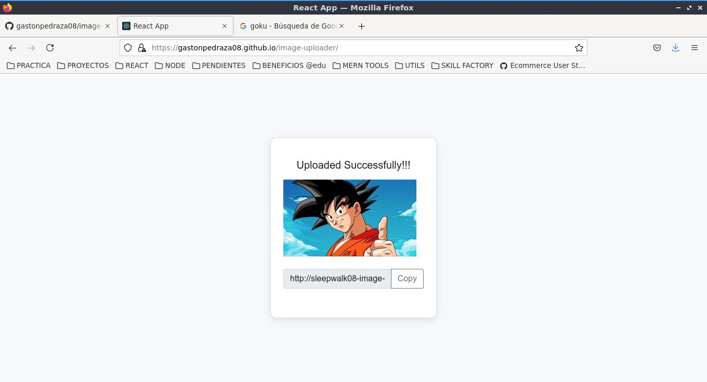

<!-- Please update value in the {}  -->

<h1 align="center">Image Uploader</h1>

<div align="center">
   Solution for a challenge from  <a href="http://devchallenges.io" target="_blank">Devchallenges.io</a>.
</div>

<div align="center">
  <h3>
    <a href="https://gastonpedraza08.github.io/image-uploader/">
      Demo
    </a>
    <span> | </span>
    <a href="https://github.com/gastonpedraza08/image-uploader">
      Solution
    </a>
    <span> | </span>
    <a href="https://devchallenges.io/challenges/O2iGT9yBd6xZBrOcVirx">
      Challenge
    </a>
  </h3>
</div>

<!-- TABLE OF CONTENTS -->

## Table of Contents

- [Overview](#overview)
  - [Built With](#built-with)
- [Features](#features)
- [How to use](#how-to-use)
- [Contact](#contact)

<!-- OVERVIEW -->

## Overview



- Click [here](https://gastonpedraza08.github.io/image-uploader/) to see a demo!
- This challenge was magnificent, and it is very practical to know the basics of how browsers work.
- With this challenge I have learned to create an API with Nodejs to store images on the server side. I have also learned the concepts of compatibility with browsers, handle drag and drop event and the handling of the clipboard (function to copy texts to the clipboard).

### Built With

<!-- This section should list any major frameworks that you built your project using. Here are a few examples.-->

- [React](https://reactjs.org/)
- [Node](https://nodejs.org/)
- [Bootstrap v4](https://getbootstrap.com/)

## Features

<!-- List the features of your application or follow the template. Don't share the figma file here :) -->

This application/site was created as a submission to a [DevChallenges](https://devchallenges.io/challenges) challenge. The [challenge](https://devchallenges.io/challenges/O2iGT9yBd6xZBrOcVirx) was to build an application so that the user can upload an image to the server by means of drag and drop.

## How To Use

<!-- Example: -->

To clone and run this application, you'll need [Git](https://git-scm.com) and [Node.js](https://nodejs.org/en/download/) (which comes with [npm](http://npmjs.com)) installed on your computer. From your command line:

```bash
# Clone this repository
$ git clone https://github.com/gastonpedraza08/image-uploader

# Install dependencies
$ npm install

# Run the app
$ npm start
```

## Contact
GitHub 
- GitHub [https://github.com/gastonpedraza08](https://github.com/gastonpedraza08)